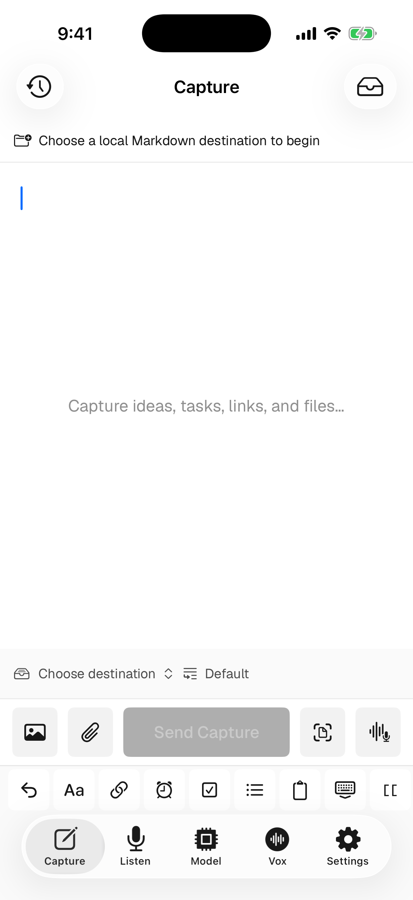

# Vox.md

> **Open source, local-first quick capture for Obsidian and Markdown on iOS and macOS.**

[](LICENSE)
[](#tech-stack)
[](#tech-stack)

Vox.md gets text, links, photos, files, scans, sketches, and voice into Obsidian vaults or local Markdown folders with minimal friction. Reusable routes can create a note, update a rolling note, target an existing file, or insert beneath a heading. Voice transcription runs on device, preferring Apple Speech on supported iOS 26 devices and using Whisper or Parakeet only when the user opts into a local model download. Audio is never uploaded to Vox.md servers.

**[🌐 Website](https://voxboard-app.vercel.app/)** · **[📲 Download](https://voxboard-app.vercel.app/)** · **[🛠 Contribute](CONTRIBUTING.md)** · **[💬 Discussions](https://github.com/CodyBontecou/Voxboard/discussions)** · **[👥 Discord](https://discord.gg/RaQYS4t6gn)** · **[⭐ Star this repo](https://github.com/CodyBontecou/Voxboard)**

## Screenshots

| Quick Capture | Works in any text field | Local settings |
|---|---|---|
|  |  |  |

## Features

### Universal Quick Capture
Capture typed text, links, photos, selected screenshots, camera images, arbitrary files, document scans with on-device OCR/PDF generation, PencilKit sketches, and voice attachments. Drafts and staged attachments are saved locally before export, so a permission or sync failure can be retried instead of losing the capture. Optional voice transcription runs on device; the audio remains usable if transcription is unavailable or fails.

The capture-first composer is a raw, selection-aware Markdown editor with undo plus bold, italic, headings, hashtags, tasks, bullets, links, wiki links, due-date tokens, timestamps, case transformations, and paste controls. Location is an explicit one-shot action that inserts a Google Maps link; Vox.md does not monitor location or keep separate coordinate history.

Reusable destinations can point at multiple Obsidian vaults or Files folders and route to new notes, existing notes, one-off notes chosen from a vault, or daily/weekly/monthly/quarterly/yearly rolling notes. Each destination supports append, prepend, insertion beneath a Markdown heading, multiline YAML/Markdown entry formatting, reusable named templates with local date/source tokens, attachment subfolders, and a resolved path preview.

### Vox Capture Workflows
A Vox describes the intent of a capture rather than its input method. The same Journal, Tasks, Meeting, or Inbox Vox can accept typed Markdown, links, photos, files, OCR scans, sketches, and voice. Each Vox can provide a default route, placement, entry template, metadata, an empty-composer prompt, and optional on-device processing. Metadata can be note-level YAML frontmatter or queryable inline fields scoped to each rolling-note entry. Manual route choices remain one-capture overrides and never mutate the Vox. Direct voice runs inherit the Vox route and then the Capture-library default; voice-only audio retention and legacy file export remain fallbacks when no Capture destination exists.

Capture processing is opt-in for typed and mixed Markdown so existing Voxes never rewrite user-authored text unexpectedly. When enabled, text-bearing payloads keep their association with audio or scans, Apple Intelligence runs locally when available, and deterministic/original-text fallbacks keep delivery working offline. The exact processed request is persisted before writing so retries do not rerun AI against changed settings.

Quick Capture is available from the app, actionable home-screen and lock-screen widgets, App Shortcuts for text/link/file/screenshot/voice input, Vox-aware deep links, and the iOS share sheet. Capture history records coarse Vox, source, route, and delivery metadata only—never note text, URLs, coordinates, bookmarks, absolute paths, or attachment filenames. Pending and failed inbox items retain the content required for recovery; immediately after delivery, Vox.md replaces each request with an ID-and-timestamp-only idempotency tombstone and sanitizes legacy completed requests on upgrade.

### Voice Keyboard
Add the Vox.md keyboard to iOS and dictate into any text field — Messages, Notes, Safari, or any app that accepts a keyboard. The keyboard toolbar controls recording and inserts finished transcripts directly where you are typing.

### On-Device Transcription
Speech recognition runs locally. On supported iOS 26 devices, Automatic uses Apple's `SpeechAnalyzer` and system-managed `SpeechTranscriber` assets. Whisper (`whisper.cpp`) and Core ML/FluidAudio-backed Parakeet models remain optional downloads and explicit overrides or fallbacks. No app-managed speech model weights ship in the app bundle. Audio, transcripts, capture drafts, and templates stay on the device.

### One-Shot Recording + Keyboard Listening
Tap **Start Recording** in the app, from Shortcuts, or from a widget to record one segment, process it locally, and automatically return the microphone session to idle. Keyboard users can still open Vox.md from the keyboard to start persistent listening, then mark recording segments from any text field.

### Model Picker
Automatic is the default on iOS and uses Apple Speech when the device and selected language support it. Users can optionally download and explicitly select Whisper Tiny, Base, Small, Medium, Large v3 Turbo, or Parakeet v2/v3. Downloaded models can also serve as Automatic's fallback.

### Transcript History
Every transcription is stored locally in the shared App Group container. Search raw text, cleaned text, titles, tags, and categories; edit saved transcripts; delete filtered selections safely; and share or export previous captures. Cross-process writes are coordinated so app and extension updates do not silently overwrite one another.

### File Export
Automatically save transcripts after each session as TXT, Markdown, or YAML. Choose a destination folder, use filename templates, append to a single file, render Markdown templates, and enable Obsidian-friendly frontmatter.

### Apple Intelligence Enrichment
On iOS 26+ devices and macOS 26+ Macs with Apple Intelligence, Vox.md can generate titles, tags, categories, cleaned-up text, and smart folder routing — still locally on-device through Apple's Foundation Models framework.

### Widgets & Live Activities
Open a durable Quick Capture draft or start and monitor recording from widgets, Live Activities, the lock screen, and Dynamic Island. The widget target shares state through the same private App Group container.

### macOS Companion
Record directly on your Mac, import audio or video files, pick local Whisper or Parakeet models, manage Vox export presets and precise Markdown capture routes, browse/copy transcript history, run Apple Intelligence enrichment on macOS 26+ capable Macs, and export TXT/Markdown/JSON/YAML notes with optional audio attachments. The Mac drains the same durable retry inbox as iOS and can reroute failed captures after a folder permission changes. It uses the shared model/history/export stack with a local Application Support fallback for unsigned development builds.

## Pricing

Vox.md includes **15 minutes of free transcription** and **10 successful Capture deliveries** so you can test the full flow. Failed writes and retries do not consume a Capture; voice transcripts routed to Markdown use only the transcription allowance.

Unlimited transcription and Capture are a one-time **$9.99** unlock. No subscription, no renewal, no ads. Users who bought the original paid app build are automatically grandfathered into unlimited access. The successful-Capture count is stored locally with an uninstall-resistant Keychain high-water mark so reinstalling on the same device does not reset the allowance.

## Tech Stack

- **Language:** Swift 5
- **UI:** SwiftUI
- **Transcription:** SpeechAnalyzer/SpeechTranscriber (iOS 26+), whisper.cpp, FluidAudio, Core ML
- **AI Enrichment:** Foundation Models / Apple Intelligence (iOS/macOS 26+)
- **Persistence:** App Group files + shared `UserDefaults`
- **Monetization:** StoreKit 2 one-time purchase
- **Minimum iOS:** 17.6
- **Minimum macOS:** 14.0
- **Recommended Xcode:** 26.2+

### Frameworks Used

| Framework | Purpose |
|-----------|---------|
| AVFoundation | Microphone capture, voice attachments, playback, and background audio recording |
| Speech | Native, on-device Apple Speech transcription on supported iOS 26 devices |
| CoreLocation | Explicit one-shot map-link insertion |
| PhotosUI | User-selected photos and screenshot-filtered input |
| KeyboardKit | Custom keyboard UI foundation |
| WidgetKit | Home screen widgets and control widgets |
| ActivityKit | Live Activities on lock screen and Dynamic Island |
| StoreKit 2 | Lifetime unlock purchase and restore |
| FoundationModels | On-device Apple Intelligence enrichment |
| UniformTypeIdentifiers | Folder and template file pickers |
| Core ML / Metal / Accelerate | Local speech model inference |

## Project Structure

```
Voxboard/
  Views/
    RootView.swift                  # Adaptive tab/sidebar shell
    ModelTabView.swift              # Automatic native selection and opt-in local model downloads
    FlowSettingsView.swift          # Manage modality-neutral Vox workflows and voice-only options
    QuickCaptureView.swift          # Durable multimodal composer with inline recording and Vox selection
    CaptureDestinationLibraryView.swift # Vault, note, placement, and heading routes
    HistoryView.swift               # Searchable/editable local transcript history
    MetaSettingsView.swift          # Preferences, upgrade, feedback, about
    PaywallView.swift               # One-time unlimited unlock
  Capture/                          # App Intents, durable draft VM, camera/scan/sketch adapters
  PersistentRecorder.swift          # Background recorder and segment capture
  TranscriptionServer.swift         # App/keyboard IPC transcription pipeline
  AppleSpeechTranscriptionBackend.swift # iOS 26 native SpeechAnalyzer backend
  FoundationModelsBackend.swift     # Apple Intelligence enrichment backend
  StoreManager.swift                # StoreKit purchase and legacy migration
  LiveActivityController.swift      # Live Activity lifecycle
  VoxboardApp.swift                 # App entry point and URL routing
  Info.plist                        # URL scheme, mic permission, audio background mode

Voxboard Keyboard/
  KeyboardViewController.swift      # Keyboard extension root controller
  VoiceToolbarView.swift            # Toolbar with model/status/record controls
  VoiceKeyboardState.swift          # Keyboard recording and transcription state
  SoundWaveView.swift               # Audio-level visualization
  VoxboardKeyboard.entitlements     # Keyboard App Group entitlement

Voxboard Share Extension/
  ShareViewController.swift         # Text/link/media/file share-sheet inbox

Voxboard Widget/
  VoxboardCaptureWidget.swift       # Home/lock-screen Quick Capture entry
  VoxboardRecordWidget.swift        # Recording widget entry point
  VoxboardRecordControl.swift       # Control widget for starting recording
  VoxboardLiveActivity.swift        # Live Activity views
  WidgetViews.swift                 # Shared widget UI

Voxboard Mac/
  VoxboardMacApp.swift              # macOS app entry point
  MacRootView.swift                 # macOS sidebar UI for listen/model/vox/history/settings
  MacRecorder.swift                 # macOS recording, import, transcription, history, export
  MacStoreManager.swift             # macOS StoreKit unlock/restore
  VoxboardMac.entitlements          # macOS sandbox, app group, mic, file access

Packages/VoxboardShared/
  Sources/VoxboardCaptureCore/      # Vox policies, payloads, routing, Markdown edits, inbox, retries
  Tests/VoxboardCaptureCoreTests/   # Framework-independent red/green capture tests
  Sources/VoxboardShared/
    AppConstants.swift              # App Group, URL scheme, shared keys
    AudioRecorder.swift             # 16kHz mono PCM capture
    ModelManager.swift              # Automatic selection and opt-in model lifecycle
    OnDeviceTranscriptionService.swift # Native-first routing and local fallback
    WhisperContext.swift            # whisper.cpp wrapper
    ParakeetContext.swift           # FluidAudio/Parakeet wrapper
    TranscriptStore.swift           # Local transcript persistence
    TranscriptFileExporter.swift    # TXT/Markdown/YAML export
    TranscriptEnricher.swift        # Title/tags/category cleanup pipeline
    UsageTracker.swift              # Free tier and unlock state

Voxboard.xcodeproj                  # Main Xcode project
whisper.xcframework                 # Whisper inference engine only; no model weights are bundled
screenshots/                        # README and marketing screenshots
fastlane/                           # App Store metadata and screenshot assets
website/                            # Static marketing, privacy, and terms pages
```

## Build Targets

| Target | Bundle ID | Platform |
|--------|-----------|----------|
| Voxboard | `bontecou.Voxboard` | iOS / iPadOS |
| Voxboard Keyboard | `bontecou.Voxboard.Voxboard-Keyboard` | iOS keyboard extension |
| Voxboard WidgetExtension | `bontecou.Voxboard.Voxboard-Widget` | iOS widgets / Live Activities |
| Voxboard Share Extension | `bontecou.Voxboard.ShareExtension` | iOS share sheet |
| Voxboard Mac | `bontecou.Voxboard.mac` | macOS companion app |

## Setup

1. Clone the repo:
   ```bash
   git clone https://github.com/CodyBontecou/Voxboard.git
   cd Vox.md
   ```
2. Open `Voxboard.xcodeproj` in Xcode 26.2+.
3. Select the **Voxboard** scheme for iOS or **Voxboard Mac** for the macOS companion.
4. Set your development team for all targets.
5. Configure the App Group entitlement (`group.bontecou.Voxboard`) for your team or replace it with your own group ID in the targets and `AppConstants.swift`.
6. Build and run on a physical device. Keyboard, microphone, background audio, and model performance are best tested on hardware.

### Required Permissions

The app requests the following permissions/settings at runtime:

- **Microphone** — records speech for local transcription or a user-requested Capture voice attachment.
- **Camera / selected photos** — used only when explicitly adding local capture media, selected screenshots, or scans.
- **Location When In Use** — requested only after tapping the location tool to insert one map link; no continuous monitoring or separate location history.
- **Keyboard Full Access** — required by iOS for the keyboard extension to access the shared container and microphone workflow.
- **Background Audio** — keeps the listening session alive while you switch apps.

### Entitlements

- App Groups (`group.bontecou.Voxboard`) — shared models, transcripts, settings, durable capture inbox data, and IPC between the app, keyboard, widgets, and share extension.
- Background Modes: Audio — persistent listening while moving between apps.
- Live Activities — lock screen and Dynamic Island controls.

## URL Scheme

The app registers the `voxboard://` URL scheme:

- `voxboard://listen` — opens Vox.md and starts the keyboard launch/listening flow.
- `voxboard://record` — legacy keyboard record entry point, redirected to listening mode.
- `voxboard://widget-record` — widget entry point for starting a recording flow.
- `voxboard://capture` — opens the durable Quick Capture composer.
- `voxboard://capture?action=photos|screenshots|camera|files|link|scan|sketch|voice` — opens the composer and requests that exact local input.
- `voxboard://capture?text=...&url=...&destination=...` — validates bounded input and opens an incoming draft.
- `voxboard://capture-request?id=...` — claims an App Group inbox request from Shortcuts/share sheet.

## Contributing

Contributions are welcome — bug reports, feature ideas, docs fixes, accessibility improvements, and pull requests. See [CONTRIBUTING.md](CONTRIBUTING.md) for setup notes and development guidelines.

If you want to chat about the project, design decisions, or what to build next, join the [Isolated Tech Discord](https://discord.gg/RaQYS4t6gn) or open a thread in [GitHub Discussions](https://github.com/CodyBontecou/Voxboard/discussions).

## License

Vox.md is licensed under the [GNU Affero General Public License v3.0](LICENSE). The AGPL ensures that any modified version of Vox.md — including ones run as a hosted service — must also be open source. This protects the privacy-first promise: nobody can take Vox.md, bolt on invasive tracking or cloud transcription, and ship it as a closed product.
