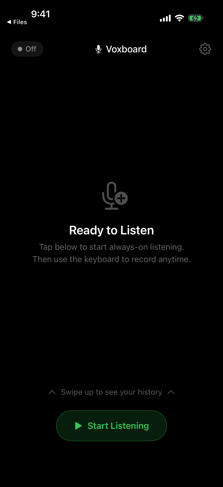
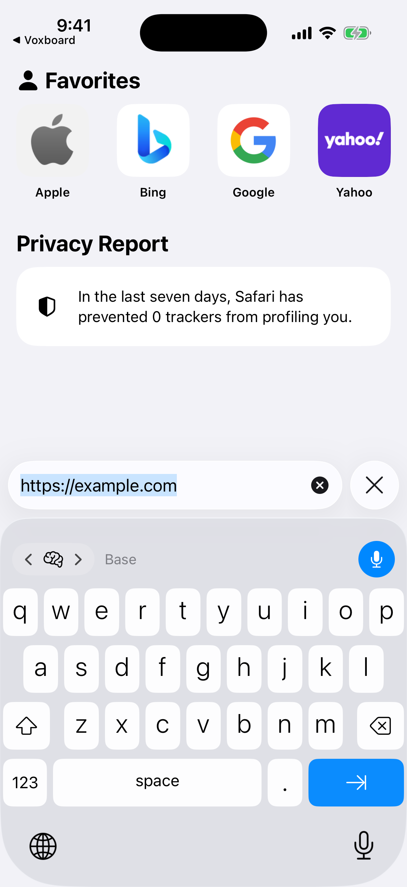
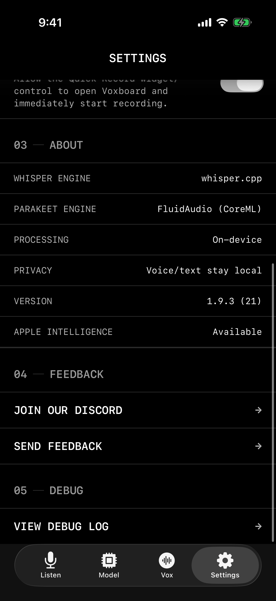

# Voxboard

> **Open source, privacy-first iOS voice-to-text keyboard — on-device transcription that works anywhere you type.**

[](LICENSE)
[](#tech-stack)
[](#tech-stack)

Voxboard is a custom iOS keyboard and transcription app for turning speech into text without sending audio to the cloud. It runs Whisper and Parakeet models on-device, saves transcript history locally, and can auto-export notes to files for workflows like Obsidian. No accounts. No analytics. No servers for your voice data. Just your keyboard, your models, and your words.

**[🌐 isolated.tech/voxboard](https://isolated.tech/voxboard)** · **[📲 Download](https://isolated.tech/voxboard)** · **[🛠 Contribute](CONTRIBUTING.md)** · **[💬 Discussions](https://github.com/CodyBontecou/Voxboard/discussions)** · **[👥 Discord](https://discord.gg/RaQYS4t6gn)** · **[⭐ Star this repo](https://github.com/CodyBontecou/Voxboard)**

## Screenshots

| Voice to text | Works in any app | Auto-save transcripts |
|---|---|---|
|  |  |  |

## Features

### Voice Keyboard
Add the Voxboard keyboard to iOS and dictate into any text field — Messages, Notes, Safari, or any app that accepts a keyboard. The keyboard toolbar controls recording and inserts finished transcripts directly where you are typing.

### On-Device Transcription
Speech recognition runs locally using `whisper.cpp` and Core ML/FluidAudio-backed Parakeet models. Audio and transcripts stay on the device. The app only uses the network for optional model downloads and normal App Store purchase flows.

### Always-On Listening
Start listening once in the app, then switch apps and use the keyboard to mark each recording segment. Voxboard keeps the recorder alive in the background, captures the segment, transcribes it, and sends the text back to the keyboard.

### Model Picker
Download and switch between multiple local models: Whisper Tiny, Base, Small, Medium, Large v3 Turbo, plus Parakeet v2/v3. Pick lighter models for speed or larger models for accuracy.

### Transcript History
Every transcription is stored locally in the shared App Group container. Browse previous transcripts, copy cleaned or raw text, and keep a searchable record of what you dictated.

### File Export
Automatically save transcripts after each session as TXT, Markdown, or YAML. Choose a destination folder, use filename templates, append to a single file, render Markdown templates, and enable Obsidian-friendly frontmatter.

### Apple Intelligence Enrichment
On iOS 26+ devices with Apple Intelligence, Voxboard can generate titles, tags, categories, cleaned-up text, and smart folder routing — still locally on-device through Apple's Foundation Models framework.

### Widgets & Live Activities
Start or monitor recording from widgets, Live Activities, the lock screen, and Dynamic Island. The widget target shares state through the same private App Group container.

## Pricing

Voxboard includes **15 minutes of free transcription** so you can test the full flow.

Unlimited transcription is a one-time **$9.99** unlock. No subscription, no renewal, no ads. Users who bought the original paid app build are automatically grandfathered into unlimited access.

## Tech Stack

- **Language:** Swift 5
- **UI:** SwiftUI
- **Transcription:** whisper.cpp, FluidAudio, Core ML, Metal, Accelerate
- **AI Enrichment:** Foundation Models / Apple Intelligence (iOS 26+)
- **Persistence:** App Group files + shared `UserDefaults`
- **Monetization:** StoreKit 2 one-time purchase
- **Minimum iOS:** 17.6
- **Recommended Xcode:** 26.2+

### Frameworks Used

| Framework | Purpose |
|-----------|---------|
| AVFoundation | Microphone capture and background audio recording |
| KeyboardKit | Custom keyboard UI foundation |
| WidgetKit | Home screen widgets and control widgets |
| ActivityKit | Live Activities on lock screen and Dynamic Island |
| StoreKit 2 | Lifetime unlock purchase and restore |
| FoundationModels | On-device Apple Intelligence enrichment |
| UniformTypeIdentifiers | Folder and template file pickers |
| Core ML / Metal / Accelerate | Local speech model inference |

## Project Structure

```
Voxboard/
  Views/
    RootView.swift                  # Adaptive tab/sidebar shell
    HomeView.swift                  # Recording controls and listening state
    ModelTabView.swift              # Download/select Whisper and Parakeet models
    FilesTabView.swift              # Auto-save, templates, smart folders
    HistoryView.swift               # Local transcript history
    MetaSettingsView.swift          # Preferences, upgrade, feedback, about
    PaywallView.swift               # One-time unlimited unlock
  PersistentRecorder.swift          # Background recorder and segment capture
  TranscriptionServer.swift         # App/keyboard IPC transcription pipeline
  FoundationModelsBackend.swift     # Apple Intelligence enrichment backend
  StoreManager.swift                # StoreKit purchase and legacy migration
  LiveActivityController.swift      # Live Activity lifecycle
  VoxboardApp.swift                 # App entry point and URL routing
  Info.plist                        # URL scheme, mic permission, audio background mode

Voxboard Keyboard/
  KeyboardViewController.swift      # Keyboard extension root controller
  VoiceToolbarView.swift            # Toolbar with model/status/record controls
  VoiceKeyboardState.swift          # Keyboard recording and transcription state
  SoundWaveView.swift               # Audio-level visualization
  VoxboardKeyboard.entitlements     # Keyboard App Group entitlement

Voxboard Widget/
  VoxboardRecordWidget.swift        # Widget entry point
  VoxboardRecordControl.swift       # Control widget for starting recording
  VoxboardLiveActivity.swift        # Live Activity views
  WidgetViews.swift                 # Shared widget UI

Packages/VoxboardShared/
  Sources/VoxboardShared/
    AppConstants.swift              # App Group, URL scheme, shared keys
    AudioRecorder.swift             # 16kHz mono PCM capture
    ModelManager.swift              # Model download, selection, languages
    WhisperContext.swift            # whisper.cpp wrapper
    ParakeetContext.swift           # FluidAudio/Parakeet wrapper
    TranscriptStore.swift           # Local transcript persistence
    TranscriptFileExporter.swift    # TXT/Markdown/YAML export
    TranscriptEnricher.swift        # Title/tags/category cleanup pipeline
    UsageTracker.swift              # Free tier and unlock state

Voxboard.xcodeproj                  # Main Xcode project
whisper.xcframework                 # Bundled whisper.cpp binary framework
screenshots/                        # README and marketing screenshots
fastlane/                           # App Store metadata and screenshot assets
website/                            # Static marketing, privacy, and terms pages
```

## Build Targets

| Target | Bundle ID | Platform |
|--------|-----------|----------|
| Voxboard | `bontecou.Voxboard` | iOS / iPadOS |
| Voxboard Keyboard | `bontecou.Voxboard.Voxboard-Keyboard` | iOS keyboard extension |
| Voxboard WidgetExtension | `bontecou.Voxboard.Voxboard-Widget` | iOS widgets / Live Activities |

## Setup

1. Clone the repo:
   ```bash
   git clone https://github.com/CodyBontecou/Voxboard.git
   cd Voxboard
   ```
2. Open `Voxboard.xcodeproj` in Xcode 26.2+.
3. Select the **Voxboard** scheme.
4. Set your development team for all targets.
5. Configure the App Group entitlement (`group.bontecou.Voxboard`) for your team or replace it with your own group ID in the targets and `AppConstants.swift`.
6. Build and run on a physical device. Keyboard, microphone, background audio, and model performance are best tested on hardware.

### Required Permissions

The app requests the following permissions/settings at runtime:

- **Microphone** — records speech for local transcription.
- **Keyboard Full Access** — required by iOS for the keyboard extension to access the shared container and microphone workflow.
- **Background Audio** — keeps the listening session alive while you switch apps.

### Entitlements

- App Groups (`group.bontecou.Voxboard`) — shared models, transcripts, settings, and IPC between the app, keyboard, and widgets.
- Background Modes: Audio — persistent listening while moving between apps.
- Live Activities — lock screen and Dynamic Island controls.

## URL Scheme

The app registers the `voxboard://` URL scheme:

- `voxboard://listen` — opens Voxboard and starts the keyboard launch/listening flow.
- `voxboard://record` — legacy keyboard record entry point, redirected to listening mode.
- `voxboard://widget-record` — widget entry point for starting a recording flow.

## Contributing

Contributions are welcome — bug reports, feature ideas, docs fixes, accessibility improvements, and pull requests. See [CONTRIBUTING.md](CONTRIBUTING.md) for setup notes and development guidelines.

If you want to chat about the project, design decisions, or what to build next, join the [Isolated Tech Discord](https://discord.gg/RaQYS4t6gn) or open a thread in [GitHub Discussions](https://github.com/CodyBontecou/Voxboard/discussions).

## License

Voxboard is licensed under the [GNU Affero General Public License v3.0](LICENSE). The AGPL ensures that any modified version of Voxboard — including ones run as a hosted service — must also be open source. This protects the privacy-first promise: nobody can take Voxboard, bolt on tracking or cloud transcription, and ship it as a closed product.
